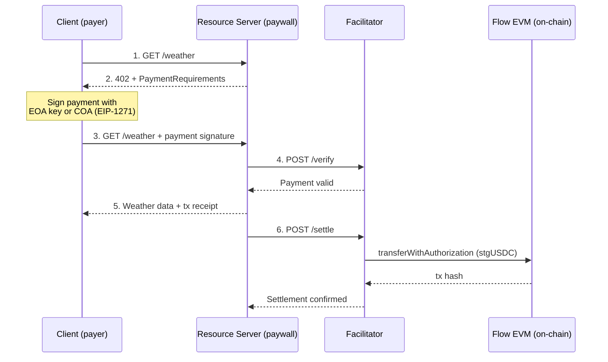

# x402 on Flow EVM

[x402](https://x402.org) payment facilitator and examples for Flow EVM (`eip155:747`).

## Overview

This repo contains:

- **Facilitator** — Verifies and settles x402 payments on Flow EVM
- **Examples** — Multiple server and client demos adapted from the [official x402 examples](https://github.com/coinbase/x402/tree/main/examples/typescript)

### Architecture



## Live Facilitator

**URL**: `https://facilitator.flowindex.io`

| Endpoint | Method | Description |
|----------|--------|-------------|
| `/verify` | POST | Verify a payment signature |
| `/settle` | POST | Settle payment on-chain |
| `/supported` | GET | List supported networks |
| `/health` | GET | Health check |

## Examples

### Servers (paywall)

| Example | Framework | Description |
|---------|-----------|-------------|
| [`server`](examples/server) | Express | Basic Express resource server |
| [`hono-server`](examples/hono-server) | Hono | Hono resource server |
| [`mcp-server`](examples/mcp-server) | MCP + Express | MCP server with paid tools |
| [`nextjs`](examples/nextjs) | Next.js | Full-stack Next.js app with `withX402` |

### Clients (payer)

| Example | Library | Description |
|---------|---------|-------------|
| [`client`](examples/client) | fetch | Native fetch with `@x402/fetch` |
| [`axios-client`](examples/axios-client) | axios | Axios with `@x402/axios` interceptor |
| [`mcp-client`](examples/mcp-client) | MCP | MCP client that pays for tool calls |

## Quick Start

### 1. Run the Resource Server (paywall)

```bash
cd examples/server
npm install
cp .env.example .env
# Edit .env: set PAY_TO_ADDRESS to your wallet
npm start
```

The server starts at `http://localhost:4021` with a paid `/weather` endpoint ($0.001 per request in stgUSDC on Flow EVM).

### 2. Run the Client (payer)

```bash
cd examples/client
npm install
cp .env.example .env
# Edit .env: set EVM_PRIVATE_KEY (needs stgUSDC on Flow EVM)
npm start
```

The client automatically handles the 402 payment flow:
1. Requests `/weather` → gets 402 + payment requirements
2. Signs payment with your private key
3. Retries with payment signature → gets weather data
4. Facilitator settles the payment on-chain

## Flow EVM Details

| Property | Value |
|----------|-------|
| Chain ID | `747` |
| CAIP-2 | `eip155:747` |
| RPC | `https://mainnet.evm.nodes.onflow.org` |
| Explorer | https://evm.flow.com |
| Gas | ~16 Gwei |

### Deployed Contracts

| Contract | Address |
|----------|---------|
| stgUSDC (FiatTokenV2_2) | [`0xF1815bd50389c46847f0Bda824eC8da914045D14`](https://evm.flow.com/address/0xF1815bd50389c46847f0Bda824eC8da914045D14) |
| Permit2 | [`0x000000000022D473030F116dDEE9F6B43aC78BA3`](https://evm.flow.com/address/0x000000000022D473030F116dDEE9F6B43aC78BA3) |
| x402ExactPermit2Proxy | [`0x402085c248EeA27D92E8b30b2C58ed07f9E20001`](https://evm.flow.com/address/0x402085c248EeA27D92E8b30b2C58ed07f9E20001) |

## Cadence (COA) Support

x402 natively supports [EIP-1271](https://eips.ethereum.org/EIPS/eip-1271) smart contract signature verification, so COA (Cadence Owned Account) users can make x402 payments without any special handling.

### Cadence Transactions

| Transaction | Description |
|-------------|-------------|
| [`setup_x402.cdc`](cadence/transactions/setup_x402.cdc) | One-shot: create COA + fund with FLOW + approve Permit2 for stgUSDC |
| [`approve_permit2.cdc`](cadence/transactions/approve_permit2.cdc) | Approve Permit2 to spend stgUSDC (if COA already exists) |

### Usage with Flow CLI

```bash
# One-shot setup: create COA, deposit 1.0 FLOW, approve max stgUSDC for Permit2
flow transactions send cadence/transactions/setup_x402.cdc \
  1.0 \
  115792089237316195423570985008687907853269984665640564039457584007913129639935 \
  --network mainnet --signer mainnet-account
```

## Self-Hosting the Facilitator

```bash
git clone https://github.com/onflow/x402-flow-facilitator.git
cd x402-flow-facilitator
npm install
cp .env.example .env
# Edit .env: set EVM_PRIVATE_KEY (needs FLOW for gas)
npm start
```

## PaymentRequirements Example

Use this in your resource server to accept payments on Flow EVM:

```typescript
{
  scheme: "exact",
  network: "eip155:747",
  asset: "0xF1815bd50389c46847f0Bda824eC8da914045D14",
  extra: {
    name: "stgUSDC",
    version: "2",
  },
}
```

## Links

- [x402 Protocol](https://x402.org)
- [x402 Docs](https://docs.x402.org)
- [Flow EVM](https://flow.com)
- [Flow EVM Explorer](https://evm.flow.com)
